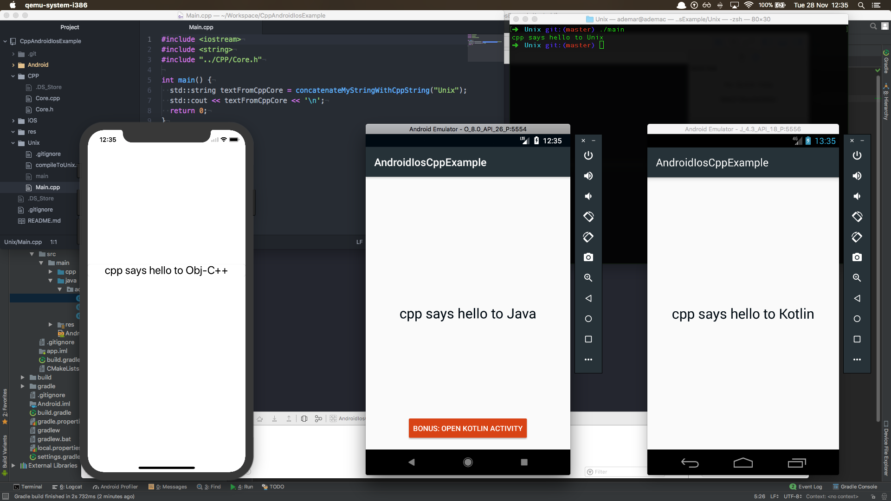
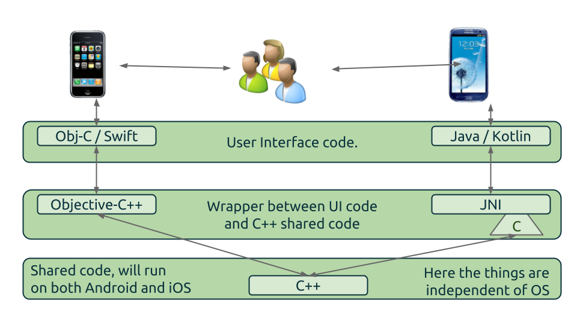
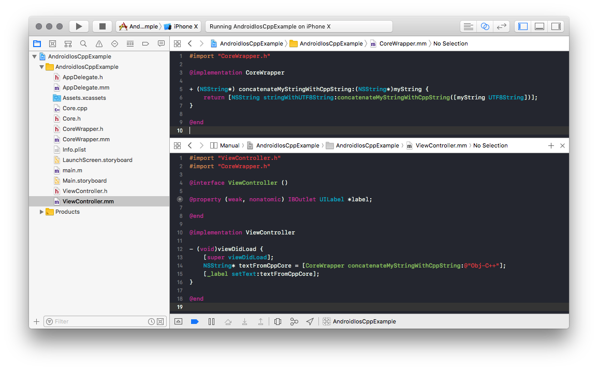
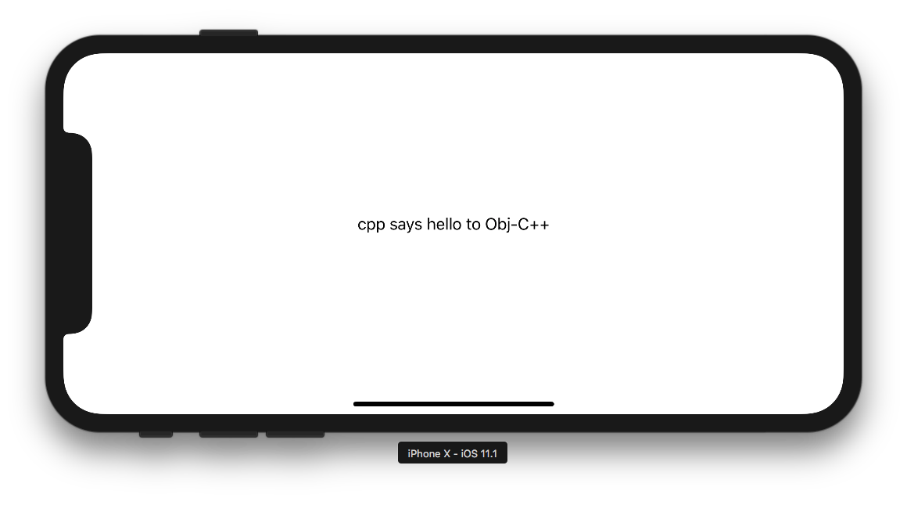
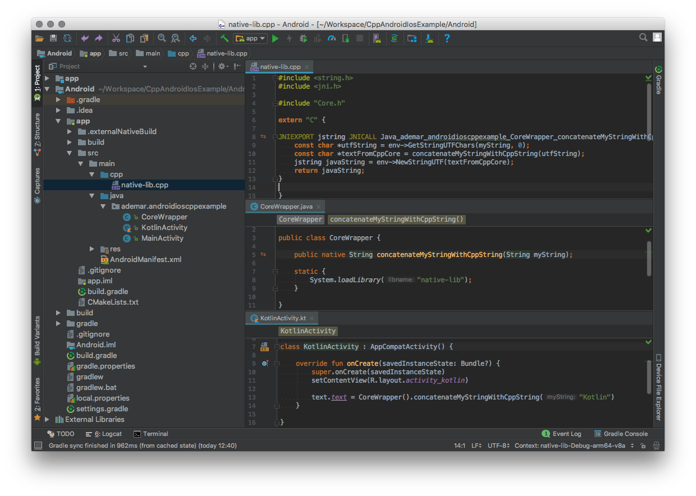
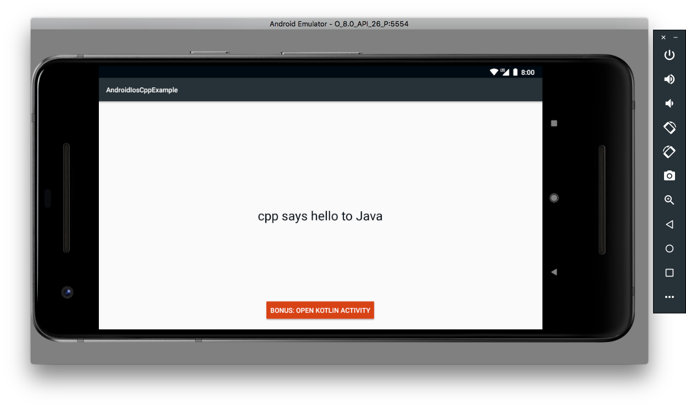
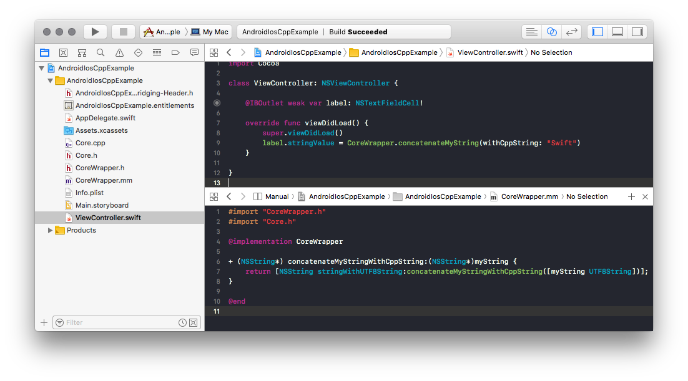
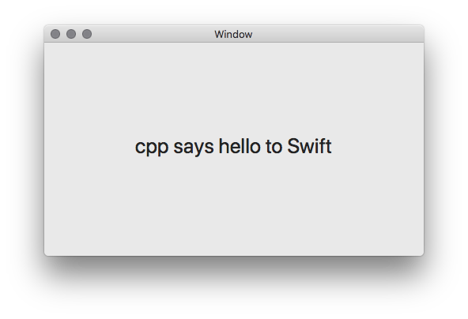

C++ Android Ios Example
====================

An application example using the same C++ code on both an Android project and an iPhone project.



You can clone the repo and run the iPhone project as well as the Android project. Following I'll explain step by step what I did, but first let take a look at this diagram.



Each OS has its UI and peculiarities, so we intend to write specific code to each platform in this regard. In other hands, all logic code, business rules, and things that can be shared we intend to write using C++, so we can compile the same code to each platform.

In the diagram, you can see the C++ layer at the lowest level. All shared code is in this segment. The highest level is regular Obj-C / Java / Kotlin code, no news here, the hard part is the middle layer.

The middle layer to iOS side is simple; you only need to configure your project to build using a variant of Obj-c know as [Objective-C++](https://en.wikipedia.org/wiki/Objective-C#Objective-C.2B.2B) and it is all, you have access to C++ code.

The thing became harder on the Android side, both languages, Java and Kotlin, on Android, run under a Java Virtual Machine. So the only way to access C++ code is using [JNI](https://en.wikipedia.org/wiki/Java_Native_Interface), please take time to read the basics of JNI. Fortunately, today's Android Studio IDE has vast improvements on JNI side, and a lot of problems are shown to you while you edit your code.

# The code by steps

Our sample is a simple app that you send a text to CPP, and it converts that text to something else and returns it. The idea is, iOS will send "Obj-C" and Android will send "Java" from their respective languages, and the CPP code will create a text as a follow "cpp says hello to _<< text received >>_".

## Shared CPP code

First of all, we are going to create the shared CPP code, doing it we have a simple [header](CPP/Core.h) file with the method declaration `concatenateMyStringWithCppString` that receives the desired text, and the CPP [implementation](CPP/Core.cpp) file.

## Unix

An interesting bonus is, we can also use the same code for Linux and Mac as well as other Unix systems. This possibility is especially useful because we can test our shared code faster, so we are going to create the [Main.cpp]() File to execute it from our machine and see if the shared code is working. To build the code, you need to execute [shell](Unix/compileToUnix.sh) helper file, and finally, you can run it with a simple `./main` the result should be:

```
$ sh compileToUnix.sh 
Compiled, now execute using ./main
$ ./main 
cpp says hello to Unix
```

## iOS

It is time to implement on the mobile side. As far as iOS has a simple integration we are starting with it. Our iOS app is a typical Obj-c app with only one difference; the files are `.mm` and not `.m`. i.e. It is an Obj-C++ app, not an Obj-C app.

To a better organization, we create the [CoreWrapper](iOS/AndroidIosCppExample/CoreWrapper.mm) file; it has the responsibility to convert CPP types and calls to Obj-C types and calls. It is not mandatory once you can call CPP code on any file you want, but it helps to keep the organization, and outside your wrapper files you maintain a complete Obj-C styled code, only the wrappers file become CPP styled.

Once your wrapper is connected to the CPP code, you can use it as a standard Obj-C code, on our example, our [ViewController](iOS/AndroidIosCppExample/ViewController.mm) is calling the wrapper and taking the string to populate our storyboard layout.

Take a look of how the app looks:




## Android

Now it is time for Android integration. Android uses Gradle as the build system, and to C/C++ code it uses CMake. So the first thing we need to do is to configure the CMake on [gradle](Android/app/build.gradle) file and the second step is to add the [CMakeList](Android/app/CMakeLists.txt) file. The CMake file is where you need to add the CPP files and header folders you will use on the project, on our example, we are adding the `CPP` folder and the Core.h/.cpp files. To know more about C/C++ configuration please [read it.](https://developer.android.com/studio/projects/add-native-code.html)

Now the core code is part of our app it is time to create the bridge, to make the things more simple and organized we create a specific class named [CoreWrapper](Android/app/src/main/java/ademar/androidioscppexample/CoreWrapper.java) to be our wrapper between JVM and CPP. Note this class has a `native` method and loads a native library named `native-lib`. This library is the one we create, in the end, the CPP code will become a shared object `.so` File embed in our APK, and the `loadLibrary` will load it. Finally, when you call the native method, the JVM will delegate the call to the loaded library.

Now the most strange part of Android integration is the JNI; please look at [native-lib.cpp](Android/app/src/main/cpp/native-lib.cpp) file, the first thing you will notice is the `extern "C"` this part is necessary to JNI work correctly with our CPP code and method linkages. You will also see some symbols JNI uses to works with JVM as `JNIEXPORT` and `JNICALL`. To you understand the meaning of those things, it is necessary to take a time and [read it](https://docs.oracle.com/javase/7/docs/technotes/guides/jni/spec/jniTOC.html), for this tutorial purposes just consider these things as boilerplate.

One significant thing and usually the root of a lot of problems is the name of the method; it needs to follow the pattern "Java\_package\_class\_method". Currently, Android studio has excellent support for it so it can generate this boilerplate automatically and show to you when it is correct or not named. On our example our method is named "Java\_ademar\_androidioscppexample\_CoreWrapper\_concatenateMyStringWithCppString" it is because "ademar.androidioscppexample" is our package, so we replace the "." by "_", CoreWrapper is the class where we are linking the native method and "concatenateMyStringWithCppString" is the method name itself.

As we have the method correctly declared it is time to analyze the arguments, the first parameter is a pointer of `JNIEnv` it is the way we have access to JNI stuff, it is crucial to we make our conversions as you will see soon. The second is a `jobject` it is the instance of the object you had used to call this method. You can think it as the java "_this_", on our example we do not need to use it, but we still need to declare it. After this jobject we are going to receive the arguments of the method because our method has only one argument, a String "myString" we have only a "jstring" with the same name. Notice also our return type is also a jstring, it is because our Java method returns a String, for more information about Java/JNI types please [read it.](https://docs.oracle.com/javase/7/docs/technotes/guides/jni/spec/types.html)

The final step is to convert the JNI types to the types we use on CPP side. On our example, we are transforming the `jstring` to a `const char *` sending it converted to the CPP, getting the result and converting back to `jstring`. As all other steps on JNI, it is not hard; it is only boilerplated, all the work is done by the `JNIEnv*` argument we receive when we call the `GetStringUTFChars` and `NewStringUTF`. After it our code is ready to run on Android devices, lets take a look.




## Bonus Swift and MacOS

Currently, there is no integration between swift and C++, so to use our C++ shared code on Swift it is necessary to use Objective-C++ as a bridge. The code is almost the same as the iOS sample, the only additional stuff is related to Swift - Obj-C integration, it is the [Bridge header](Swift/AndroidIosCppExample/AndroidIosCppExample-Bridging-Header.h). To see how flexible our CPP code is, the swift sample is a MacOS app, enjoy.




Thank you for read, please let me know any question you have.
